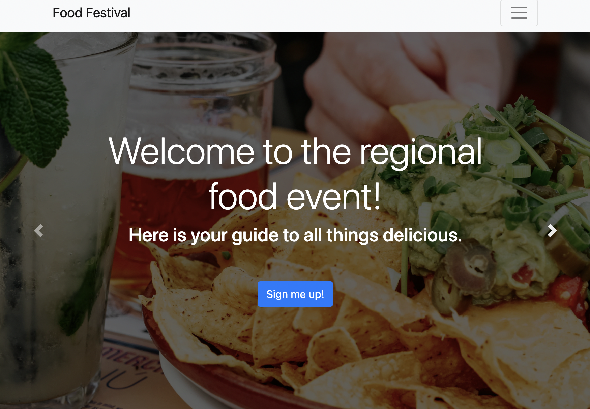
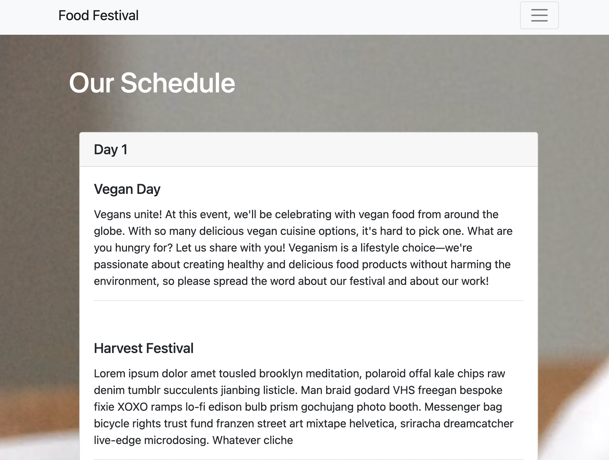
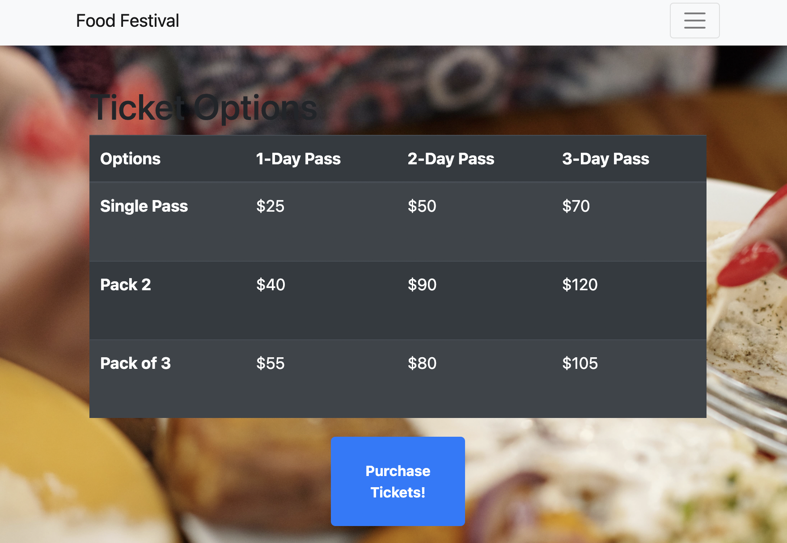

# Food Festival

## Description

This project takes the application `Food Festival`, which offers information, scheduling, and ticket purchasing, and improves its performance by minifying assets, adding offline functinoality, and turning it into a Progressive Web Application.

## Table of Contents

- [Installation](#Installation)
- [Usage](#Usage)
- [License](#License)
- [Questions](#Questions)

## Installation

Clone the repository to your local machine. From the root folder of this repository, run the commands `npm init -y` followed by `npm i`. 

## Usage

To host the application locally use the command `npm start:dev`, which uses the webpack-development-server to host the project. 

## License

A short and simple permissive license with conditions only requiring preservation of copyright and license notices. Licensed works, modifications, and larger works may be distributed under different terms and without source code.

## Questions

If you have any questions, concerns, or comments, feel free to contact me:

-GitHub: [Zacharycampanelli](https://github.com/Zacharycampanelli)  
-Email: [zaccamp@optonline.net](mailto:zaccamp@optonline.net)
